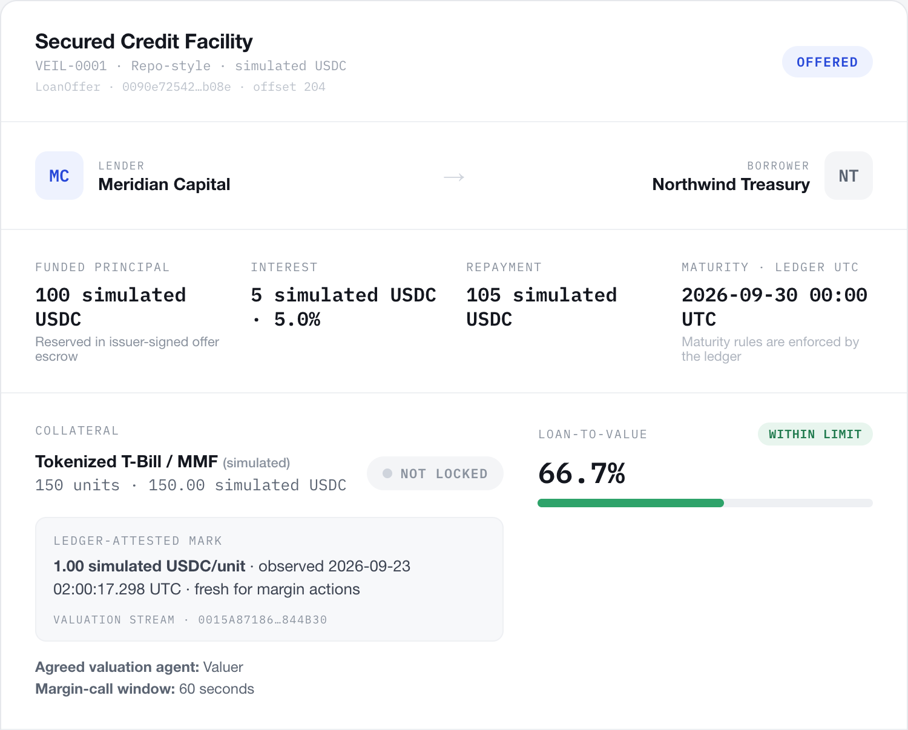

<!-- _class: dark cover -->

HackCanton Season 3 / team briefing

# Veil

Private financing with funded offers and a complete margin-call lifecycle.

Reserve principal<b>→</b>Manage collateral<b>→</b>Repay and release

No Witness Labs · Two-person build team Local Canton model · Version 0.5.0

<!--
Audience: our team and the invited Canton reviewers. This is a project-direction
briefing, not the three-minute product demo; use SEASON3-DEMO-SCRIPT.md for that.
All assets and institutions shown in the UI are simulated. The 0.5.0 implementation
merged in PR #39 on September 22, 2026. No external audit or customer trial has occurred.
-->

---

The decision

## Improve Veil around one complete workflow

01
<h3>A working base</h3>
Private offers, repayment, and role views already exist. Our two-person team can focus on the missing risk controls.

02
<h3>Visible new value</h3>
Reserve principal, recheck collateral value, issue a timed call, cure it, and close the loan. Judges can follow the whole flow.

03
<h3>A useful review role</h3>
The invited team's Canton and audit experience fits authorization, valuation lineage, time boundaries, and privacy review.

We can build and test the prototype now. An institutional partner helps validate the workflow and define custody, signing, and settlement for a pilot.

<!--
The CTO asked us to focus on Veil. The recommendation is to build on existing
assets with a clearly disclosed new increment. Starting a new application would
require another domain model and integration surface before we could demonstrate
this level of end-to-end behavior. Institutional backing is not required to build
a sandbox prototype; it becomes useful when proving real operating value.
-->

---

Customer hypothesis

## Private execution for known counterparties

For lending operations teams financing a known treasury counterparty against tokenized collateral.

<h3>Today: our hypothesis</h3>
Teams coordinate terms, price checks, margin calls, and settlement across separate systems.

The pain to validate: who owns the current state, what is due, and what each party may see.

<h3>With the Veil demo</h3>
The ledger enforces the agreed transitions, value checks, deadlines, and contract visibility.

The lender supplies principal; the borrower receives financing and can cure a collateral breach.

Next validation: show the workflow to 3 lending or treasury operators and test whether it matches one real deal. No interviews or willingness-to-pay evidence yet.

<!--
This slide is a product hypothesis, not market evidence. We have no user quotes,
customer commitments, market sizing, or measured savings. Potential buyer: the
lender's operations or technology owner; a paid pilot or software fee is only a
hypothesis until we understand their integration and operating requirements.
-->

---

What is new

## A disclosed baseline, a concrete increment

<h3>Earlier Veil</h3>

Private offers and demo holdings. Acceptance and repayment. Role views and an earlier hosted demo.

Earlier maturity work also exists. Season 3 integrates that policy into the new lifecycle.

Baseline: 2455470 · Earlier video and deck remain prior-work artifacts.

<h3>This Season 3 increment</h3>

<strong>Funding:</strong> controlled issuer and reserved principal.

<strong>Valuation:</strong> agreed price stream, freshness, and origination LTV checks.

<strong>Risk:</strong> timed calls, exact top-ups, recovery, and maturity integration.

<strong>Evidence:</strong> matching UI, local contract tests, and browser checks.

Merged implementation: PR #36 · PR #38 · PR #39. Scope and attribution: docs/SEASON3.md.

<!--
Source: docs/SEASON3.md, ADR 0002, PRs 36/38/39. Prior PRs 24, 32, and 34
predate this increment and are not being claimed wholesale as new work. Existing
work is disclosed; final eligibility and track selection remain organizer decisions.
-->

---

Hackathon fit / proposed Track 2

## A financial workflow that uses Canton directly

<table>
<thead><tr><th>TRACK EXPECTATION</th><th>VEIL DEMONSTRATION</th></tr></thead>
<tbody>
<tr><td>A financial MVP</td><td>Bilateral collateralized financing with funding and risk controls.</td></tr>
<tr><td>Economic flows</td><td>100 principal delivered; 105 repaid; locked collateral returned.</td></tr>
<tr><td>Network activity</td><td>Offers, price updates, calls, cures, and closes create ledger transactions.</td></tr>
<tr><td>Target user and GTM</td><td>Lender operations first; validate one workflow before a scoped pilot.</td></tr>
</tbody>
</table>

<strong>Why Canton:</strong> contract-level visibility, multi-party authorization, and atomic changes to cash and collateral state.

Track 2 is our proposal. Current activity is local and simulated, not live volume. Track brief: hackathon.appsfactory.cc/season-3.

<!--
Track expectations are from the organizer track brief supplied in this conversation.
No current registration, prize, deadline, or eligibility claim is made. A database
can support a centrally operated workflow; our hypothesis is that counterparties
benefit from shared, jointly authorized state with scoped views. The local demo
does not yet validate privacy across independently operated Canton participants.
-->

---

Funded offers / current product

## The lender reserves principal before acceptance

<h3>Fund</h3>
The normal lender flow consumes cash and reserves 100 in the offer.

<h3>Accept or withdraw</h3>
Both consume the same offer. Principal is delivered or refunded once.

<h3>Explicit issuer trust</h3>
The trusted issuer can mint supply and directly authorize offers. It sees holdings and loans.

Actual local 0.5.0 screen. Meridian Capital and Northwind Treasury are fictional demo names. No real asset backing or custody is established.

<!--
Source: CashHolding.MakeOffer, LoanOffer.Accept/Withdraw and ADR 0002. The issuer
can co-authorize privileged direct construction, including offers. Conservation is
an invariant of normal choices between issuance and reset, not proof against issuer
collusion or proof of external reserves. Ordinary browser actions omit issuer actAs.
-->

---

The demo's decisive moment

## A price shock becomes a controlled cure

01 / healthy

66.7%
<h3>150 units × 1.00</h3>
Collateral value: 150 Principal: 100 Offer and acceptance allowed.

02 / breached

107.5%
<h3>150 units × 0.62</h3>
Collateral value: 93 Threshold: 90% Lender opens a 60-second call.

03 / cured

80.6%
<h3>200 units × 0.62</h3>
Borrower adds exactly 50. Collateral value: 124 The margin call clears.

<strong>Close:</strong> repay 105 simulated USDC → lender receives 105 → borrower receives all 200 locked units.

LTV = principal ÷ collateral value. Fixed interest is included in repayment, not LTV. All prices are manually attested demo marks.

<!--
Ledger time enforces the call deadline. Top-up must commit before both the deadline
and maturity with a fresh price proving LTV strictly below 90%. Alternative paths:
recovered price resolves a call; expired call plus fresh breach permits margin
liquidation; strictly overdue maturity permits liquidation without a price.
See SEASON3-DEMO-SCRIPT.md for the exact three-minute click path and recovery steps.
-->

---

<!-- _class: privacy -->

Privacy and authority

## Every role has an explicit visibility boundary

<table>
<thead><tr><th>ROLE</th><th>ACTIVE-CONTRACT VIEW IN THE DEMO</th></tr></thead>
<tbody>
<tr><td>Lender and borrower</td><td>Shared deals and marks; each party's own free holdings.</td></tr>
<tr><td>Regulator</td><td>Observes deal, settlement, and valuation records.</td></tr>
<tr><td>Valuer</td><td>Valuation records and counterparties; no loan or settlement.</td></tr>
<tr><td>Demo issuer</td><td>Its holdings and associated offer, loan, and settlement records.</td></tr>
<tr><td>Outsider</td><td>Empty active-contract response: []</td></tr>
</tbody>
</table>

This is one participant with local authentication disabled. Independent identities, participant privacy, and transaction disclosures still need validation.

The client selects its configured issuer; the raw party query is preserved. Active views do not revoke historical disclosures.

<!--
Source: template signatory/observer declarations; local role-query checks in SEASON3.md.
Do not equate role switching with production authentication. The demo operator
controls all authorities, including reset. The valuer's lack of active loan records
is tested; invite reviewers to check transaction-level divulgence and fetch effects.
-->

---

Evidence / implementation merged September 22, 2026

## Local behavior is tested; adoption is unvalidated

34 scripts

Daml regression scripts pass, plus shared setup. Production and frontend builds pass.

Full flow

Local Chrome exercised funding, refunds, guarded acceptance, margin, cure, and repayment.

<h3>Lifecycle conservation</h3>
Between issuance and reset: cash + offer reserves = 205; free + locked collateral = 200.

<h3>Remaining proof</h3>
External audit, user trials, independent signing, asset integration, and a validated hosted deployment.

Recorded on 404ab01; merged as e25da25 in PR #39. GitHub CI jobs did not start due to a billing lock; owner-authorized merge used local checks. Detail: docs/SEASON3.md.

<!--
34 named scripts plus setup means 35 runner entries, not 35 separate test cases.
The runner emits a non-fatal six-element fixture tuple warning. Chrome evidence
includes deliberate rejection cases and role visibility; it is internal verification,
not independent assurance. Conservation excludes authorized minting/reset. Earlier
public demo links and automatic previews are not proof of this version on DevNet.
-->

---

<!-- _class: dark -->

Work with the invited Canton team

## Challenge the model, then help shape the pilot

<h3>01 / Reproduce</h3>
Run the three-minute demo and contract tests. Follow the real contract IDs and transaction evidence.

<h3>02 / Review</h3>
Check issuer trust, fund conservation, valuation lineage, timing races, and disclosure boundaries.

<h3>03 / Improve</h3>
Bring a better use case or new ideas. Help identify one operator and the smallest useful pilot.

Next pilot requirements: independent signing, an asset/custody integration, a valuation source, and an agreed operating workflow.

<a href="https://github.com/no-witness-labs/veil-lite-hackathon">github.com/no-witness-labs/veil-lite-hackathon</a> <a href="https://hackathon.appsfactory.cc/season-3">hackathon.appsfactory.cc/season-3</a>

<!--
Handoff files: docs/SEASON3-DEMO-SCRIPT.md and docs/SEASON3-AUDIT-HANDOFF.md.
No review work, institutional partnership, interview, or deployment is implied by
this invitation. We have prepared these artifacts for sharing; no outreach was sent.
-->
