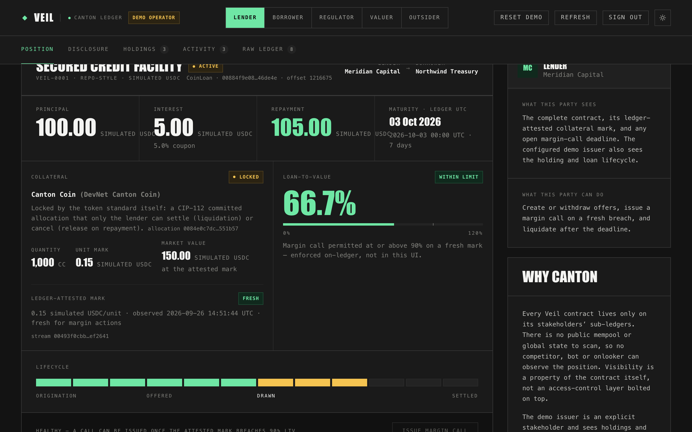

<!-- _class: dark cover -->

HackCanton Season 3 · Track 2 — Financial Applications

# Veil

Private secured lending on Canton — with collateral locked by the Canton Coin token standard itself.

Fund<b>→</b>Lock collateral<b>→</b>Margin-call &amp; cure<b>→</b>Repay or liquidate

Live on the HackCanton DevNet node · <a href="https://veil-lite-hackathon.vercel.app">veil-lite-hackathon.vercel.app</a> · no sign-up needed No Witness Labs

---

The problem

## Secured lending needs privacy and enforceable collateral

<h3>Public chains leak the book</h3>
Counterparties, sizes, collateral and liquidation levels become public. Institutions can't run a repo or credit desk like that.

<h3>Off-chain is fragmented</h3>
Terms, price checks, margin calls and settlement live in emails, spreadsheets and custodian systems — nobody holds one enforceable state.

Veil gives two known counterparties one private, enforceable loan: the ledger checks every transition, and only the parties who need to see a contract can.

---

The product

## A complete loan lifecycle, enforced on-ledger

<table>
<tr><th>Stage</th><th>What Canton enforces</th></tr>
<tr><td>Offer</td><td>Lender pre-funds the principal; terms (LTV threshold, call window, maturity) are chosen by the user</td></tr>
<tr><td>Accept</td><td>Fresh attested price must show LTV below threshold; collateral locks and principal is delivered in <b>one</b> transaction</td></tr>
<tr><td>Margin call</td><td>Only on a fresh breach; a ledger-time deadline. Cure by top-up, <b>cash pay-down</b>, or price recovery</td></tr>
<tr><td>During the loan</td><td>Partial repayment; <b>collateral substitution</b> (T-Bill → MMF) with lender approval and an LTV re-check</td></tr>
<tr><td>Close</td><td>Repay releases collateral; liquidation only after an expired call on a breached mark, or after maturity</td></tr>
</table>

---

New this season

## Real Canton Coin collateral, locked by CIP-112

<h3>A committed allocation, not an escrow account</h3>

On acceptance the borrower's Canton Coin is locked in a <b>Token Standard V2 committed allocation</b> whose only executor is the lender.

✓ Borrower's early withdrawal <b>refused by Canton Coin itself</b> ✓ Repay → allocation cancelled, coin unlocks ✓ Liquidation → settled to the lender via <code>SettleBatch</code> ✓ Verified on hackcanton-01 with real DevNet CC

---

Why Canton

## Privacy and atomicity are structural, not bolted on

Need-to-know

Lender, borrower and regulator see the loan; the valuer sees only its prices; an outsider's ledger query returns <code>[]</code>.

Atomic

Lock collateral + check LTV + deliver principal + open the loan: one multi-party transaction, or nothing.

Composable

Collateral uses the network's own token standard (CIP-112) — the same primitive any Canton asset can plug into.

The in-app Disclosure tab shows the signatory/observer matrix for every contract; the Raw ledger tab shows exactly what each party's ledger query returns.

---

Economic flows

## Who moves what, and why

<b>Lender</b> earns fixed interest on principal it pre-funds; protected by a locked, enforceable claim on collateral.

<b>Borrower</b> gets liquidity without selling its assets; can cure calls with cash or more collateral, or swap collateral.

<b>Valuer</b> publishes signed prices on a stream both counterparties authorised.

<b>Regulator</b> observes positions and settlements without taking part.

Network activity per loan

Each loan is 6–10 ledger transactions: funding, a token-standard allocation, price updates, margin actions, and a token-standard settlement or cancellation.

Not built: protocol fees, valuer fees, stablecoin principal (principal is simulated USDC today).

---

Architecture

## Small, auditable, deployed

<table>
<tr><th>Layer</th><th>What it is</th></tr>
<tr><td>Contracts</td><td>Daml package <code>veil-lite</code> 0.8.1 on hackcanton-01; Token Standard V2 interfaces (exact vetted packages)</td></tr>
<tr><td>Server</td><td>Vercel functions: per-party sessions, per-party read/act checks, read-only token-registry proxy</td></tr>
<tr><td>App</td><td>React UI with role views, disclosure matrix and raw ledger inspector</td></tr>
<tr><td>Evidence</td><td>49 Daml scripts · 13 server tests · 49 live auth checks · 12 browser checks · DevNet runs with real CC</td></tr>
</table>

Trust boundary, stated plainly: on the shared node one ledger user hosts all demo parties, so our server enforces role separation there; valuations are manually attested; T-Bill/MMF and USDC are simulated.

---

Try it

## Two minutes on the live app

Canton Coin loan

1. Valuer → Canton Coin → publish 0.15 2. Lender → collateral <b>Canton Coin (real)</b> → Create offer 3. Borrower → Accept (1,000 CC locks) 4. Valuer → 0.11 · Lender → Issue margin call 5. Borrower → Pay down 30 → Repay (CC unlocks)

Privacy check

Enter as <b>Outsider</b> → Raw ledger: <code>[]</code>. Enter as <b>Valuer</b>: prices only, no loan. Enter as <b>Regulator</b>: the loan and its settlement, read-only.

Open access: pick a party and click Enter.

---

Next

## From demo to pilot

01
<h3>Validate the user</h3>
Walk 3 lending / treasury operators through one real deal. No customer evidence yet.

02
<h3>Real signing</h3>
Each counterparty on its own participant or wallet (CIP-103 dApp API) instead of a shared ledger user.

03
<h3>Real assets and prices</h3>
Stablecoin principal and tokenised T-Bills via the token standard; an independent price source instead of a manual valuer.

